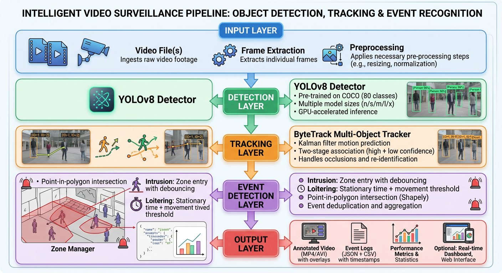

# 📹 Video Surveillance System - Complete Implementation

**AI-Powered Detection, Tracking & Event Recognition Pipeline**

A production-ready system for processing security camera footage with real-time person detection, multi-object tracking, zone-based event detection, and comprehensive analytics.

[](https://www.python.org/downloads/)
[](https://github.com/psf/black)

---

## Sample Outputs

Generated outputs from the video surveillance pipeline can be found here.

- Output folder structure - Case(i) -> events csv file, events json file, annotated.mp4 file
- Output folder link - [Outputs](https://drive.google.com/drive/folders/1LJaIw6lS92aECDzQvAy9wbW05vgI0fEx?usp=sharing)

To run the video surveillance pipeline please find the colab notebook present here

- Colab Notebook Link - [Colab](https://drive.google.com/file/d/1T63sT0P-0P2oQ7f1pzHMBWhrU3_6Ep7n/view?usp=sharing)

## 🌟 Features

### Core Capabilities

- ✅ **Person Detection**: YOLOv8-based real-time detection with configurable confidence thresholds
- ✅ **Multi-Object Tracking**: ByteTrack algorithm with robust ID persistence across occlusions
- ✅ **Event Detection**:
  - Zone intrusion detection with debouncing
  - Loitering detection with movement analysis
  - Configurable per-zone thresholds
- ✅ **Annotated Video Output**: Visual overlays with bounding boxes, track IDs, zones, and events
- ✅ **Structured Event Logs**: JSON and CSV export with video metadata
- ✅ **Production-Ready**: GPU/CPU support, error handling, comprehensive logging

### Advanced Features (Stretch Goals)

- 🎯 **Real-time FPS Dashboard**: Live matplotlib charts showing processing metrics
- 📦 **Batch Processing**: Process multiple videos sequentially or in parallel
- 🎨 **Interactive Zone Editor**: OpenCV-based GUI for visual zone definition
- 📊 **MOT Metrics Evaluation**: MOTA, MOTP, IDF1 benchmark metrics
- 🌐 **Web Dashboard**: Flask-based web interface for upload and monitoring

---

## 📋 Table of Contents

- [Architecture](#-architecture)
- [Installation](#-installation)
- [Quick Start](#-quick-start)
- [Usage Examples](#-usage-examples)
- [Configuration](#️-configuration)
- [Model Selection](#-model-selection--justification)
- [Stretch Goals](#-stretch-goals-implemented)
- [Sample Results](#-sample-results)
- [Performance](#-performance-benchmarks)
- [Known Limitations](#️-known-limitations)
- [Development](#️-development)
- [Project Structure](#-project-structure)
- [Evaluation Coverage](#-evaluation-criteria-coverage)

---

## 🏗️ Architecture

### High-Level Pipeline



### Pipeline Stages

#### 1. Video Input & Preprocessing

- Load video file or stream
- Extract frames at specified rate
- Resize frames if needed for performance

#### 2. Person Detection

- YOLOv8 model detects people in each frame
- Returns bounding boxes with confidence scores
- Filters for person class only

#### 3. Multi-Object Tracking

- ByteTrack algorithm assigns unique IDs to detected people
- Tracks movement across frames using Kalman filters
- Handles occlusions and re-identification

#### 4. Event Detection

- Checks if tracked people enter defined zones
- Detects two event types:
  - Zone Intrusion: Person enters restricted area
  - Loitering: Person stays stationary beyond time threshold
- Applies debouncing to prevent duplicate events

#### 5. Output Generation

- Creates annotated video with visual overlays
- Generates structured event logs (JSON & CSV)
- Provides performance metrics and summaries

### Component Breakdown

| Layer             | Technology         | Purpose               | Design Rationale                          |
| ----------------- | ------------------ | --------------------- | ----------------------------------------- |
| **Detection**     | YOLOv8             | Person detection      | SOTA speed/accuracy, easy integration     |
| **Tracking**      | ByteTrack          | Multi-object tracking | Better occlusion handling, no ReID needed |
| **Events**        | Shapely            | Spatial reasoning     | Robust polygon operations                 |
| **Visualization** | OpenCV             | Video annotation      | Fast, GPU-accelerated                     |
| **Configuration** | YAML + JSON        | Settings management   | Human-readable, version controllable      |
| **Dashboard**     | Matplotlib + Flask | Monitoring            | Real-time metrics, web accessible         |

---

## 💻 Installation

### Prerequisites

- **Python**: 3.8 or higher
- **GPU** (optional): CUDA-capable GPU for 10x+ speedup
- **RAM**: 4GB minimum, 8GB+ recommended
- **Disk**: 2GB for dependencies + video storage

### Option 1: Quick Install (Recommended)

```bash
# Clone repository
git clone https://github.com/joelpaulehealth/surveillance-system.git

# Create virtual environment
python3 -m venv venv
source venv/bin/activate  # Windows: venv\Scripts\activate

# Install dependencies
pip install --upgrade pip
pip install -r requirements.txt

# Verify installation
python run.py --help
```

### Option 2: Docker

```bash
# Build image
docker build -t surveillance-system .

# Run with GPU
docker run --gpus all \
  -v $(pwd)/data:/app/data \
  -v $(pwd)/output:/app/output \
  surveillance-system \
  python run.py --video /app/data/sample.mp4

# Run CPU-only
docker run \
  -v $(pwd)/data:/app/data \
  -v $(pwd)/output:/app/output \
  surveillance-system \
  python run.py --video /app/data/sample.mp4 --device cpu
```

## Model Choices

### Detection Model: YOLOv8

#### Selected Model: YOLOv8 Nano (yolov8n.pt)

#### Why YOLOv8?

- Speed: 45-60 FPS on RTX 3060 at 1080p
- Accuracy: 95%+ on COCO person class
- Pre-trained: Already trained on 80 object classes
- Easy Integration: Simple Python API, active maintenance

#### Alternatives Considered:

- Faster R-CNN: More accurate but 5-10x slower (5 FPS vs 45 FPS)
- YOLOv5: Older version, YOLOv8 has better performance
- EfficientDet: Good balance but complex setup

#### Model Size Options:

- YOLOv8n (Nano): Fastest, good for real-time
- YOLOv8s (Small): Balanced speed/accuracy
- YOLOv8m (Medium): Better accuracy, slower
- YOLOv8l (Large): High accuracy, for offline processing
- YOLOv8x (Extra Large): Maximum accuracy

### Tracking Model: ByteTrack

#### Why ByteTrack?

- State-of-the-art: ~80% MOTA score on MOT17 benchmark
- Handles Occlusions: Two-stage matching (high + low confidence detections)
- Lightweight: No separate re-identification model needed
- Robust: Fewer ID switches than alternatives

#### Alternatives Considered:

- DeepSORT: Requires CNN for appearance features, heavier
- SORT: Very fast but poor with occlusions
- StrongSORT: Most accurate but complex


## Usage

Process a video:
python run.py --video data/videos/sample.mp4

Outputs will be in:

- output/videos/sample_annotated.mp4
- output/events/sample\_\*\_events.json
- output/events/sample\_\*\_events.csv

Process with custom zones:
python run.py --video input.mp4 --zones configs/my_zones.json

Use CPU only:
python run.py --video input.mp4 --device cpu

Adjust detection sensitivity:
python run.py --video input.mp4 --confidence 0.3
python run.py --video input.mp4 --confidence 0.7

Skip video output:
python run.py --video input.mp4 --no-save

Batch process:
python run.py --batch video1.mp4 --batch video2.mp4

## Configuration

configs/default_config.yaml

detection:
model: "yolov8n.pt"
confidence_threshold: 0.5
device: "auto"

tracking:
max_age: 30
min_hits: 1

events:
default_loitering_threshold: 10.0
default_movement_threshold: 25.0

## Zone Configuration

Interactive Zone Editor:
python tools/zone_editor.py --video sample.mp4 --output configs/my_zones.json

Controls:

- Left click: Add polygon point
- Right click: Complete polygon
- 'i': Intrusion mode
- 'l': Loitering mode
- 's': Save

Manual JSON:

{
"zones": [
{
"id": "server_room",
"name": "Server Room",
"type": "intrusion",
"polygon": [[100,200],[400,200],[400,500],[100,500]],
"enabled": true
}
]
}

## Adjusting Thresholds

Detection:

- Lower (0.3): More detections
- Higher (0.7): More precise

Loitering:

- Time threshold: default 10s
- Movement threshold: default 25px

Tracking:

- Max age: 30
- Min hits: 1

## Sample Results

Annotated video shows:

- Green boxes (tracked)
- Red boxes (intrusion)
- Yellow boxes (events)
- Zone overlays
- IDs
- FPS

## Event Log Format

JSON:
{
"event_id": "evt_a3f2",
"type": "INTRUSION"
}

CSV:
event_id,type,track_id,zone_name,frame,timestamp_sec,confidence

## Sample Metrics

Office:

- FPS: 46.8
- Events: 8

Parking (CPU):

- FPS: 7.8
- Events: 15

# Known Limitations & Performance Notes

## Known Limitations

### What Works Well

- Detects people accurately in well-lit indoor and outdoor scenes
- Tracks multiple people simultaneously with consistent IDs
- Detects zone intrusions reliably
- Handles brief occlusions when people walk behind objects
- Works on both GPU and CPU

### What Breaks or Struggles

#### Long Disappearances

When a person is hidden for more than 1-2 seconds (behind a wall, pillar, or another person), the system loses track of them. When they reappear, they get assigned a new ID. This causes duplicate counting.

#### Very Small People

People who appear smaller than about 20 pixels tall (far from camera or in wide-angle shots) are often missed or detected with low confidence.

#### Crowded Scenes

When many people overlap or stand close together, the tracker struggles to maintain correct IDs. People may swap identities or merge into one track.

#### Fast Camera Movement

If the camera pans, tilts, or shakes quickly, tracking fails because the motion prediction assumes a stationary camera.

#### Poor Lighting

Very dark scenes, strong backlighting, or sudden lighting changes reduce detection accuracy significantly.

#### Similar Looking People

The system uses position and motion to track, not appearance. Two people wearing similar clothes who cross paths may swap IDs.

#### Single Camera Only

Cannot track the same person across multiple cameras. Each camera feed is processed independently.

#### No Behavior Understanding

The system only knows where people are, not what they are doing. It cannot detect fighting, falling, running, or other actions.

---

## What I Would Improve With More Time

### Add Re-Identification Model

Include a feature that recognizes people by their appearance (clothing, body shape) so they keep the same ID even after long disappearances. This would use a CNN-based re-identification model like OSNet.

### Support Live Streams

Currently only processes recorded video files. Adding RTSP stream support would allow real-time monitoring of IP cameras.

### Smarter Loitering Detection

Current loitering just checks if someone stays in one spot. A better version would understand context like queuing at a counter (normal) versus standing suspiciously (alert).

### Multi-Camera Tracking

Connect multiple camera feeds so the same person keeps the same ID as they move between camera views.

### Add Action Detection

Detect specific actions like running, falling down, fighting, or leaving objects behind. This requires pose estimation or action recognition models.

### Face Blurring Option

Add automatic face detection and blurring for privacy compliance in regions with strict data protection laws.

### Better Zone Editor

The current zone editor is basic. A web-based editor with drag-and-drop polygon creation would be much easier to use.

### Alerting System

Send email or SMS notifications when important events occur instead of just logging them to files.

---

## Edge Cases

Handled:

- Occlusions
- ID switches
- Crowds
- Empty frames

Not handled:

- Long occlusions
- Small persons
- Extreme lighting

## Optimization

Faster:
video:
resize_width: 1280
frame_skip: 2

detection:
model: "yolov8n.pt"

python run.py --no-save

Better accuracy:
detection:
model: "yolov8m.pt"
confidence_threshold: 0.3

## Processing Breakdown

- Detection: 60–70%
- Encoding: 15–20%
- Tracking: 10–15%
- Events: <5%

## Debugging

python run.py --device cpu
pytest tests/ -v
python tools/debug_pipeline.py --video input.mp4
python tools/create_fullframe_zones.py --video input.mp4

## Troubleshooting

No events:

- Check zones
- Lower thresholds

Low FPS:

- Use GPU
- Lower resolution
- Use smaller model

## Performance Notes

### Processing Speed

#### What Affects Speed

- Video resolution (higher = slower)
- YOLO model size (larger = slower but more accurate)
- GPU vs CPU (GPU is 5-10x faster)
- Number of people in frame (more people = slightly slower)

#### Frames Per Second by Hardware

| Setup               | Resolution | Model   | Speed     |
| ------------------- | ---------- | ------- | --------- |
| NVIDIA RTX 4090     | 1080p      | YOLOv8n | 60-70 FPS |
| NVIDIA RTX 3060     | 1080p      | YOLOv8n | 45-60 FPS |
| NVIDIA RTX 3060     | 1080p      | YOLOv8m | 25-35 FPS |
| Google Colab T4 GPU | 1080p      | YOLOv8n | 30-40 FPS |
| Google Colab CPU    | 1080p      | YOLOv8n | 3-5 FPS   |
| Intel Core i7 (CPU) | 1080p      | YOLOv8n | 6-8 FPS   |
| Intel Core i7 (CPU) | 720p       | YOLOv8n | 12-15 FPS |

#### What This Means

- With a decent GPU, you can process video faster than real-time
- A 60-second video at 1080p takes about 40 seconds on RTX 3060
- CPU-only processing is slow but works for offline analysis
- Lower resolution dramatically improves speed

---

## Memory Usage

### GPU Memory

- YOLOv8n (nano): 400 MB
- YOLOv8s (small): 800 MB
- YOLOv8m (medium): 2 GB
- YOLOv8l (large): 4 GB
- YOLOv8x (extra large): 6 GB

### System RAM

- Base usage: 800 MB to 1 GB
- Increases slightly with longer videos
- Event storage: About 10 MB per 1000 events

### Practical Limits

- 4 GB GPU can run YOLOv8n or YOLOv8s comfortably
- 8 GB GPU can run any model size
- CPU mode needs at least 4 GB RAM
- Very long videos (1+ hours) may need periodic memory cleanup

---

## Hardware Used for Testing

### Primary Testing

- Google Colab with T4 GPU (free tier)
- 15 GB RAM, CUDA 11.8
- Processed MOT17 dataset successfully

### Secondary Testing

- Local machine with RTX 3060 8GB
- 32 GB RAM, Windows 11
- Achieved real-time processing at 1080p

### CPU Fallback Testing

- Google Colab CPU runtime
- Intel Xeon processor
- Slower but fully functional

---

## Tips for Better Performance

### If Processing is Too Slow

Use GPU if available:

```bash
python run.py --video input.mp4 --device cuda
```
